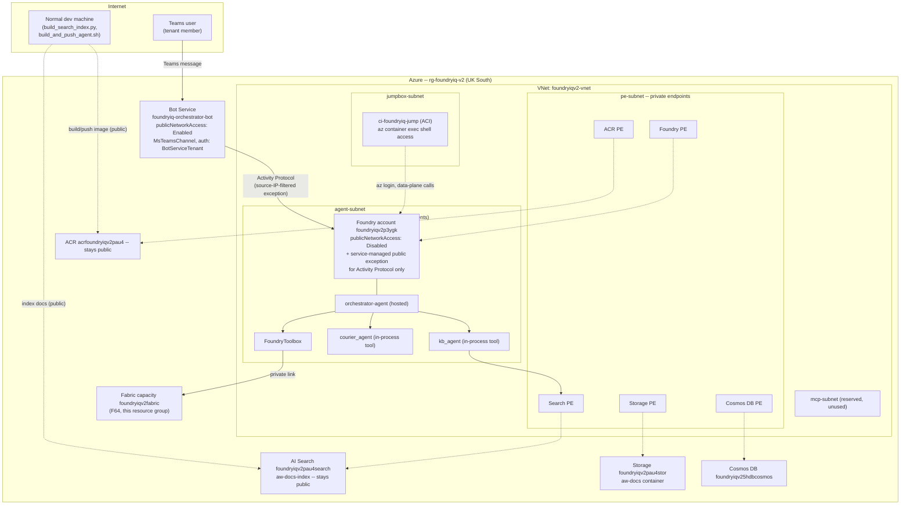

# Foundry IQ v2 — Private Multi-Agent Orchestration

Three hosted agents (Microsoft Agent Framework, Python) running on a fully
VNet-integrated Microsoft Foundry environment: `publicNetworkAccess:
Disabled` on the Foundry account, and every dependent data service behind a
private endpoint.

See `.claude/plans/dazzling-watching-garden.md` (on the machine this was
built on) for the full phased plan and decisions.

## Architecture



`kb-agent` and `courier-agent` are also independently registered as their own hosted
agent versions in the same project — reachable directly (from inside the VNet), no
orchestrator required.

Bot Service is the one deliberately public-facing piece: `publicNetworkAccess: Enabled`
on the Bot Service resource itself, talking to the private Foundry account only through
a service-managed, source-IP-filtered public exception that Foundry exposes for the
Activity Protocol route alone (Bot Service/Microsoft 365 source ranges only —
everything else on the project, Responses API and agent management, stays fully
private). See "Bot Service / Teams" below for the full design rationale and the
auth-scheme trade-offs that shaped it.

## Three hard-won findings that shaped this design

1. **Foundry-to-Foundry A2A is broken.** `tasks/get` always returns `TaskNotFound` after
   a successful `message/send` — confirmed via both raw JSON-RPC and the official
   `A2APreviewTool` SDK path. `kb_agent`/`courier_agent` are wired into the orchestrator
   in-process via `agent_framework.Agent.as_tool()` instead.
2. **The "BYO VNet" template you get pointed at by default doesn't support MCP tools
   behind the VNet.** `anihitk07/foundry-hosted-agents-e2e-samples`' `04-byo-vnet-private`
   mirrors Microsoft's template **15**, whose README says outright it doesn't support
   agent tools (MCP, OpenAPI, Functions, A2A) behind the VNet. Template **19**
   (`azure-ai-foundry/foundry-samples`, `19-private-network-agent-tools`) does — its
   supported-tools list explicitly names Fabric Data Agent and MCP, and it registers a
   `privatelink.fabric.microsoft.com` DNS zone (real private-link support for Fabric,
   not a guess). This repo's `infra/` is adapted from template 19, not 15.
3. **Native web search *does* work behind this VNet posture.** This was flagged as an
   open risk in the plan before building (web search isn't in template 19's
   documented supported-tools list) — testing confirmed it works fine with no
   workaround needed. `courier-agent` needs nothing special.

Also confirmed the hard way: a Foundry account's `networkInjections` is set at
creation time and can't be retrofitted onto an existing account — there's no
"convert to private" path, only "create a new private one." The original public
account (`foundryiqv2pau4`) was decommissioned once this environment was verified
working end-to-end.

## Resources (`rg-foundryiq-v2`, UK South)

- `foundryiqv2p3ygk` — Foundry account (network-injected, `publicNetworkAccess: Disabled`) + project `iqv2project`
- `foundryiqv2-vnet` — VNet, 4 subnets (agent, pe, mcp, jumpbox), 12 private DNS zones
- `foundryiqv2pau4search` — AI Search (semantic search, index `aw-docs-index`) — **stays public**, only gained a private endpoint alongside (needed so `scripts/build_search_index.py` can still run from a normal dev machine)
- `foundryiqv2pau4stor` — Storage (`aw-docs` container) — public-network access was already governance-locked to `Disabled` in this tenant before this project started; gained a private endpoint too
- `acrfoundryiqv2pau4` — ACR (Premium) — **stays public** (needed for `az acr build`, since the jumpbox has no Docker), gained a private endpoint alongside
- `foundryiqv25hdbcosmos` — Cosmos DB for NoSQL (new; required by Foundry's standard agent setup, didn't exist before) — private endpoint only
- `law-foundryiqv2-*` — Log Analytics workspace (for Application Insights / agent tracing)
- `ci-foundryiq-jump` — jumpbox (Azure Container Instance in `jumpbox-subnet`) — see below
- `foundryiq-orchestrator-bot` — Bot Service (`publicNetworkAccess: Enabled`), MS Teams channel, fronting `orchestrator-agent` — see "Bot Service / Teams" below
- `foundryiqv2fabric` — Fabric capacity (F64), under Bicep (`infra/06-fabric-capacity.bicep`); must be **Active** (not Paused) for the Fabric tool to work — see "Fabric capacity & artifacts" below

## Why the jumpbox is a container, not a VM

This subscription has zero available VM SKUs in UK South (`az vm list-skus` returns no
unrestricted sizes at all) — the same compute restriction hit earlier in this project,
where Azure Container Instances was the one working option. So the jumpbox is an ACI
container instead of the reference architecture's VM + Bastion: `az container exec`
gives shell access directly, no Bastion needed.

Real consequence: **the jumpbox has no Docker** (no Docker-in-Docker in standard ACI),
so the usual `azd deploy` build+push+register flow doesn't work from inside the VNet.
See "Deploying agent updates" below for the actual two-step process this project uses
instead.

## Agents (`agents/`)

- `kb-agent/` — grounded in the Foundry IQ Knowledge Base (Adventure Works PDFs)
- `courier-agent/` — FedEx/UPS/DHL assistant via the native `WebSearchTool`
- `orchestrator-agent/` — routes to `kb_agent`/`courier_agent` in-process, and to Fabric
  via the `fabric-iq-toolbox` toolbox (OBO-enabled — see the toolbox's own
  `UserEntraToken` connection, `fabric-dataagent-obo`)

None of these agents' Python code changed for the migration to private — only how
they're built and registered changed (see below).

A SharePoint-grounded agent was explored earlier (Work IQ, direct Graph API, the native
Foundry SharePoint tool, a Copilot Studio agent via the Direct-to-Engine API) but
dropped — every path hit either a tenant admin-consent wall or an undocumented/broken
backend connection lookup. Not part of this build.

## Infra (`infra/`)

Numbered by deployment order — `01` and `02` have no dependency on each other's
completion beyond both needing the VNet, `03` needs both, `04` (jumpbox) only needs `01`:

- `01-network.bicep` — VNet + 3 subnets + 12 private DNS zones (`modules/vnet.bicep`, `modules/dns-zones.bicep`)
- `02-data-services.bicep` — private endpoints for the *existing* Search/Storage/ACR (no recreation) + new Cosmos DB + Log Analytics
- `03-foundry-account.bicep` — the network-injected Foundry account + project + model deployments + capability host + RBAC + connections (Cosmos/Storage/Search/ACR)
- `04-jumpbox.bicep` — the ACI jumpbox + its subnet
- `05-bot-service.bicep` — Bot Service + Teams channel, fronting the private `orchestrator-agent` (see "Bot Service / Teams" below)
- `06-fabric-capacity.bicep` — the Fabric capacity (see "Fabric capacity & artifacts" below)

## Setup sequence (fresh environment)

1. `az deployment group create -g rg-foundryiq-v2 -f infra/01-network.bicep`
2. `az deployment group create -g rg-foundryiq-v2 -f infra/02-data-services.bicep --parameters searchName=<name> storageName=<name> acrName=<name> vnetName=foundryiqv2-vnet peSubnetName=pe-subnet`
3. `az deployment group create -g rg-foundryiq-v2 -f infra/03-foundry-account.bicep --parameters agentSubnetId=<id> peSubnetId=<id> searchName=<name> storageName=<name> cosmosName=<name>`
4. `az deployment group create -g rg-foundryiq-v2 -f infra/04-jumpbox.bicep --parameters vnetName=foundryiqv2-vnet`
5. Upload PDFs and build the search index: `python scripts/build_search_index.py` (runs from a normal dev machine — Search stayed public)
6. From inside the jumpbox (`az container exec -g rg-foundryiq-v2 -n ci-foundryiq-jump --container-name jumpbox --exec-command "az login --use-device-code"`, complete the device-code prompt): `scripts/create_fabric_toolbox.sh <fabric-workspace-id> <fabric-data-agent-id>`
7. Build + register each agent (see below)
8. Publish `orchestrator-agent` to Teams (see "Bot Service / Teams" below)

## Deploying agent updates

`azd deploy` doesn't work here — it can't reach the private project endpoint from
outside the VNet, and can't build images from inside the jumpbox (no Docker there).
Two steps instead:

1. **Build + push the image** (from a normal dev machine — ACR stayed public):
   `scripts/build_and_push_agent.sh kb-agent`
2. **Register the agent version** (from inside the jumpbox — data-plane call to the
   private project): `scripts/register_hosted_agent.sh kb-agent '{"AZURE_AI_MODEL_DEPLOYMENT_NAME":"gpt-4.1","AZURE_SEARCH_ENDPOINT":"https://foundryiqv2pau4search.search.windows.net","AZURE_SEARCH_KNOWLEDGE_BASE_NAME":"aw-knowledge-base"}'`
   (Don't set `FOUNDRY_PROJECT_ENDPOINT` or any other `FOUNDRY_*`/`AGENT_*` var yourself
   — reserved, auto-injected by the platform.)
3. Grant the new agent's `AgentIdentity` (`instance_identity.principal_id` in the
   registration response) whatever RBAC it needs — Search roles for `kb-agent`/
   `orchestrator-agent`, `Foundry User` on the project for `orchestrator-agent`
   (needed to read the Fabric toolbox connection). None for `courier-agent`.
4. Test: `scripts/invoke_hosted_agent.sh kb-agent "What is Adventure Works' refund policy?"` (from inside the jumpbox)

## Bot Service / Teams

`orchestrator-agent` is also reachable from Microsoft Teams, via Azure Bot Service --
kept publicly accessible (per the ask that started this piece: "keep it publicly
accessible but connected to Foundry orchestrator agent over private endpoint"), wired
to the private agent through Foundry's own native publishing mechanism, not a custom
relay.

**How it works:** Foundry exposes a service-managed, source-IP-filtered public
exception for the agent's Activity Protocol route only (Bot Service and Microsoft 365
source ranges) -- everything else on the project (Responses API, agent management)
stays fully private. The Bot Service resource's `endpoint` points directly at that
exception URL, which Microsoft's Bot Service/Teams infrastructure reaches without ever
touching our VNet.

**Why Teams, not Direct Line:** tested directly. A raw/anonymous Direct Line caller
can't satisfy either Bot Service authorization scheme (`BotServiceRbac` needs Azure
RBAC on the Foundry project; `BotServiceTenant` needs the caller to be a signed-in
tenant member) -- Direct Line's classic secret-based flow never carries a real
per-caller Entra token through to Foundry. Teams does, since every Teams message
already carries the sender's own signed-in token. This repo uses `BotServiceTenant`:
any signed-in member of this tenant can use the bot via Teams. Not anonymous-public --
the broadest this native mechanism supports. Genuinely anonymous public access would
need a different architecture (APIM/relay inside the VNet, translating Bot Framework
Activity protocol to the Responses API) -- deliberately not what this repo builds,
since the native mechanism above is far simpler and meets the actual requirement.

**Why `publicNetworkAccess: Enabled` on the Bot Service resource itself**, unlike
Microsoft's own reference example (which sets it `Disabled` for a fully locked-down
scenario): tested directly, `Disabled` also blocks Direct Line's/Teams' own
client-facing API (`NetworkDenied`), not just inbound Foundry traffic. The private half
of this design is entirely on the Foundry side (the source-IP-filtered exception); this
resource is meant to be reachable.

**Setup, from inside the jumpbox:**
```sh
scripts/enable_agent_teams_endpoint.sh orchestrator-agent BotServiceTenant
# then deploy infra/05-bot-service.bicep with msaAppId = the agent's
# instance_identity.client_id (printed by the script above), then:
scripts/publish_agent_to_teams.sh orchestrator-agent
```
The publish step (Microsoft 365 app publish) is required -- without it, a Teams deep
link built from the raw agent identity App ID resolves to nothing ("couldn't find the
bot"), even with the Bot Service resource and Foundry endpoint correctly wired up.

Reference: [Publish an agent as a Bot Service behind a VNet](https://learn.microsoft.com/en-us/azure/foundry/agents/how-to/publish-copilot-virtual-network).

## Fabric capacity & artifacts

The Fabric capacity now lives in this resource group as `foundryiqv2fabric` (F64),
under Bicep (`infra/06-fabric-capacity.bicep`). It replaces `fabric3iq`, which was
created manually in a separate resource group (`rg-3iqdemo`) before this project
started.

**Why it's a new capacity, not the original one moved:** a direct ARM resource-group
move of `fabric3iq` was attempted first and failed with
`ResourceMoveTimedOut: Move resources for provider 'Microsoft.Fabric' did not finish
within allowed time '00:15:00'` -- confirmed as a known limitation (Microsoft's own
guidance for cross-group Fabric moves is to provision a new capacity in the target
group and reassign workspaces to it, not rely on ARM move), not a one-off failure worth
retrying. So that's what happened instead: `foundryiqv2fabric` deployed here via Bicep,
the one workspace that was on `fabric3iq` (`awworkspace`) reassigned to it via the
Fabric REST API (`POST /v1/workspaces/{id}/assignToCapacity` -- a workspace's ID, and
everything in it, is unaffected by which capacity backs it), then `fabric3iq` deleted
once confirmed empty. `scripts/create_fabric_toolbox.sh` needed no changes -- it points
at the workspace/Data Agent by their own IDs, not the capacity.

Region stayed **West US**, matching the original: Fabric workspaces are region-pinned
to whatever capacity they're assigned to at creation, so reassigning across regions
risks a data-residency change, not just a compute move -- this resource group already
spans regions (UK South for most resources, West US for Fabric, `global` for DNS
zones), which is normal for Azure resource groups.

**How much of Fabric Bicep actually reaches:** `Microsoft.Fabric/capacities` is a real
ARM resource type (stable API `2023-11-01`) — the capacity itself is fully
Bicep-managed. Everything *inside* Fabric — workspaces, and every item type in them
(Lakehouse, Data Agent, Ontology, notebooks, etc.) — has **no ARM resource type at
all**. Those live entirely in the Fabric control plane, reachable only through the
Fabric REST API (`api.fabric.microsoft.com`) — the same way `scripts/create_fabric_toolbox.sh`
already talks to Fabric for the OBO connection. So there's no Bicep for
workspaces/items; `scripts/provision_fabric_workspace.sh` is the script-based
equivalent — idempotent find-or-create for a workspace (assigned to this capacity) plus
Lakehouse, Ontology, and Data Agent item shells in it.

**Note on capacity state:** `state` (Active/Paused) is a read-only ARM property —
Bicep/PUT can't set it, only a dedicated resume/suspend action can.
`scripts/set_fabric_capacity_state.sh resume|suspend` does that.

```sh
scripts/set_fabric_capacity_state.sh resume            # capacity must be Active first
scripts/provision_fabric_workspace.sh foundryiq-workspace foundryiqv2fabric
```

Items created this way are empty shells — a Lakehouse with no tables, an Ontology with
no schema, a Data Agent with no configured data source. Configuring them (loading
tables, defining the ontology schema, wiring the Data Agent's data source +
instructions) is a Fabric-portal/Fabric-SDK task that doesn't reduce to a single REST
POST — do that once, then point `scripts/create_fabric_toolbox.sh` at the resulting
workspace ID and Data Agent ID as before.

This is additive: `provision_fabric_workspace.sh` creates a new workspace by default
(`foundryiq-workspace`), separate from whatever workspace already backs the
orchestrator's live Fabric toolbox — pass that workspace's own display name as the
first argument to target it instead.

## Verification

- `nslookup`/`getent hosts` each private-linked FQDN from the jumpbox resolves to a
  `192.168.1.x` address, not a public one.
- Public internet access to the Foundry account's endpoint fails with 403
  (`Public access is disabled. Please configure private endpoint.`).
- Each of the three agents answers correctly when invoked from the jumpbox — confirmed
  end-to-end: kb-agent (KB citation), courier-agent (live web search with citations),
  orchestrator-agent (routed to the Fabric toolbox, returned real data).
