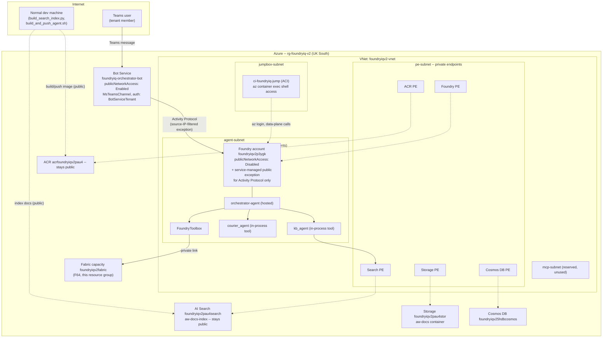

# Foundry IQ v2 — Private Multi-Agent Orchestration

Three hosted agents (Microsoft Agent Framework, Python) running on a fully
VNet-integrated Microsoft Foundry environment: `publicNetworkAccess:
Disabled` on the Foundry account, and every dependent data service behind a
private endpoint.

## Architecture



`kb-agent` and `courier-agent` are also independently registered as their own hosted
agent versions in the same project — reachable directly (from inside the VNet), no
orchestrator required.

## Prerequisites

- An Azure subscription with: Contributor on the target resource group, a Microsoft
  Foundry (Cognitive Services) resource provider with hosted-agent preview features
  available, and Microsoft Fabric capacity licensing (an F-SKU).
- **Azure CLI** (`az`), with the Bicep extension: `az bicep install`.
- **Python 3.10+** — for `scripts/build_search_index.py`. Docker is not required
  locally: agent images build cloud-side via ACR Tasks (`az acr build`).
- `az login` access to the subscription (for infra deploys and any command run
  from a normal dev machine) and `az container exec` access to the jumpbox (for
  the data-plane steps that must run from inside the VNet — see "Step-by-step
  setup" below for which is which).

## Configuration (`.env`)

```sh
cp .env.example .env
```

`.env.example` (repo root) lists every variable the scripts and agents read, grouped
by what needs it:

| Variable | Used by | Where it comes from |
|---|---|---|
| `FOUNDRY_PROJECT_ENDPOINT` | every agent, `build_search_index.py` | `az cognitiveservices account show` output, after step 4 below |
| `AZURE_AI_MODEL_DEPLOYMENT_NAME` | every agent, `build_search_index.py` | set by `infra/03-foundry-account.bicep` — default `gpt-4.1` |
| `AZURE_SEARCH_ENDPOINT` | `kb-agent`, `orchestrator-agent`, `build_search_index.py` | your AI Search resource |
| `AZURE_OPENAI_ENDPOINT` | `build_search_index.py` | same Foundry account as above, OpenAI-compatible endpoint |
| `AZURE_EMBEDDING_MODEL_DEPLOYMENT_NAME` | `build_search_index.py` | set by `infra/03-foundry-account.bicep` — default `text-embedding-3-large` |
| `AZURE_SEARCH_INDEX_NAME` / `AZURE_SEARCH_KNOWLEDGE_SOURCE_NAME` / `AZURE_SEARCH_KNOWLEDGE_BASE_NAME` | `build_search_index.py`, `kb-agent`, `orchestrator-agent` | names it creates — defaults are fine unless you want different names |
| `SUBSCRIPTION_ID` / `RESOURCE_GROUP` / `ACCOUNT_NAME` / `PROJECT_NAME` / `ACR_NAME` / `ACR_LOGIN_SERVER` | the shell scripts in `scripts/` | your actual resource names — only needed if they differ from each script's built-in defaults |

Python code (`load_dotenv()`) finds this root `.env` automatically no matter which
subdirectory you run it from. The shell scripts read plain environment variables —
either `export` the file first (`set -a; source .env; set +a`) or rely on each
script's own hardcoded defaults if your resource names match this project's.

`.env` is gitignored — never commit it.

## Resources (`rg-foundryiq-v2`, UK South)

- `foundryiqv2p3ygk` — Foundry account (network-injected, `publicNetworkAccess: Disabled`) + project `iqv2project`
- `foundryiqv2-vnet` — VNet, 4 subnets (agent, pe, mcp, jumpbox), 12 private DNS zones
- `foundryiqv2pau4search` — AI Search (semantic search, index `aw-docs-index`) — stays public, private endpoint added alongside
- `foundryiqv2pau4stor` — Storage (`aw-docs` container) — public network access locked `Disabled` by tenant policy; private endpoint added
- `acrfoundryiqv2pau4` — ACR (Premium) — stays public (used by `az acr build`), private endpoint added alongside
- `foundryiqv25hdbcosmos` — Cosmos DB for NoSQL (required by Foundry's standard agent setup) — private endpoint only
- `law-foundryiqv2-*` — Log Analytics workspace (Application Insights / agent tracing)
- `ci-foundryiq-jump` — jumpbox (Azure Container Instance in `jumpbox-subnet`) — shell access via `az container exec`, no VM/Bastion
- `foundryiq-orchestrator-bot` — Bot Service (`publicNetworkAccess: Enabled`), MS Teams channel, fronting `orchestrator-agent` — see "Bot Service / Teams" below
- `foundryiqv2fabric` — Fabric capacity (F64), under Bicep (`infra/06-fabric-capacity.bicep`); must be **Active** (not Paused) for the Fabric tool to work — see "Fabric capacity & artifacts" below

## Repo layout

- `agents/` — `kb-agent/`, `courier-agent/`, `orchestrator-agent/` (see "Agents" below)
- `infra/` — numbered Bicep files, one per deployment step (see "Infra" below)
- `scripts/` — deployment/operational scripts (shell + `build_search_index.py`)
- `data/aw-docs/` — the 3 source PDFs the knowledge base is built from (see "Knowledge base" below)
- `.env.example` — copy to `.env` and fill in (see "Configuration" above)

## Agents (`agents/`)

- `kb-agent/` — grounded in the Foundry IQ Knowledge Base (Adventure Works PDFs)
- `courier-agent/` — FedEx/UPS/DHL assistant via the native `WebSearchTool`
- `orchestrator-agent/` — routes to `kb_agent`/`courier_agent` in-process, and to Fabric
  via the `fabric-iq-toolbox` toolbox (OBO-enabled — see the toolbox's own
  `UserEntraToken` connection, `fabric-dataagent-obo`)

`kb_agent`/`courier_agent` are wired into the orchestrator in-process
(`agent_framework.Agent.as_tool()`), not via Foundry-to-Foundry A2A.

## Infra (`infra/`)

Numbered by deployment order — `01` and `02` have no dependency on each other's
completion beyond both needing the VNet, `03` needs both, `04` (jumpbox) only needs `01`:

- `01-network.bicep` — VNet + 3 subnets + 12 private DNS zones (`modules/vnet.bicep`, `modules/dns-zones.bicep`)
- `02-data-services.bicep` — private endpoints for the *existing* Search/Storage/ACR (no recreation) + new Cosmos DB + Log Analytics
- `03-foundry-account.bicep` — the network-injected Foundry account + project + model deployments + capability host + RBAC + connections (Cosmos/Storage/Search/ACR)
- `04-jumpbox.bicep` — the ACI jumpbox + its subnet
- `05-bot-service.bicep` — Bot Service + Teams channel, fronting the private `orchestrator-agent` (see "Bot Service / Teams" below)
- `06-fabric-capacity.bicep` — the Fabric capacity (see "Fabric capacity & artifacts" below)

## Step-by-step setup (fresh environment)

1. **Clone and configure.**
   ```sh
   git clone https://github.com/pranabpaul-tech/foundry-iq-v2.git
   cd foundry-iq-v2
   cp .env.example .env
   ```
   Fill in `SUBSCRIPTION_ID`/`RESOURCE_GROUP` now; the rest get filled in as you go.

2. **Deploy the network.**
   ```sh
   az deployment group create -g rg-foundryiq-v2 -f infra/01-network.bicep
   ```

3. **Add private endpoints to your existing Search/Storage/ACR + deploy Cosmos DB.**
   ```sh
   az deployment group create -g rg-foundryiq-v2 -f infra/02-data-services.bicep \
     --parameters searchName=<name> storageName=<name> acrName=<name> \
                  vnetName=foundryiqv2-vnet peSubnetName=pe-subnet
   ```

4. **Deploy the Foundry account + project.** The capability-host step normally takes
   30–35 minutes — that's expected, not a hang.
   ```sh
   az deployment group create -g rg-foundryiq-v2 -f infra/03-foundry-account.bicep \
     --parameters agentSubnetId=<id> peSubnetId=<id> \
                  searchName=<name> storageName=<name> cosmosName=<name>
   ```
   Then fill `.env`'s `FOUNDRY_PROJECT_ENDPOINT`, `AZURE_SEARCH_ENDPOINT`, and
   `AZURE_OPENAI_ENDPOINT` from:
   ```sh
   az cognitiveservices account show -g rg-foundryiq-v2 -n <account-name> --query properties.endpoints
   ```

5. **Deploy the jumpbox** (used for every data-plane call the private project endpoint
   requires — registering agents, granting RBAC, the Fabric/Teams REST calls below).
   ```sh
   az deployment group create -g rg-foundryiq-v2 -f infra/04-jumpbox.bicep --parameters vnetName=foundryiqv2-vnet
   az container exec -g rg-foundryiq-v2 -n ci-foundryiq-jump --container-name jumpbox \
     --exec-command "az login --use-device-code"
   ```
   Complete the device-code prompt. Every later "from inside the jumpbox" step reuses
   this same `az container exec ... --exec-command "<command>"` pattern.

6. **Build the knowledge base** (from a normal dev machine — Search stayed public).
   See "Knowledge base: PDFs, chunking, and embedding" below for what this does.
   ```sh
   pip install -r scripts/requirements.txt
   az login
   python scripts/build_search_index.py
   ```

7. **Provision (or point at) a Fabric workspace + Data Agent.** If you don't already
   have one, see "Fabric capacity & artifacts" below for `provision_fabric_workspace.sh`.
   Then, from inside the jumpbox, create the toolbox connection:
   ```sh
   scripts/create_fabric_toolbox.sh <fabric-workspace-id> <fabric-data-agent-id>
   ```

8. **Build, push, and register each agent** (`kb-agent`, `courier-agent`,
   `orchestrator-agent`) — see "Deploying agent updates" below for the exact two-step
   command sequence and the RBAC each agent identity needs. Run it once per agent.

9. **(Optional) Publish `orchestrator-agent` to Microsoft Teams** — see "Bot Service /
   Teams" below.

10. **Verify** — see "Verification" below.

## Knowledge base: PDFs, chunking, and embedding

Source PDFs live in `data/aw-docs/` (checked into this repo, 3 files). Add, remove, or
replace PDFs there to change what `kb-agent`/`orchestrator-agent` can answer from — no
code changes needed, `scripts/build_search_index.py` picks up every `*.pdf` in that
directory automatically.

```sh
pip install -r scripts/requirements.txt
az login
python scripts/build_search_index.py
```

What it does, in order:

1. Extracts text from every PDF in `data/aw-docs/` (`pypdf`).
2. Splits each document's text into chunks — `CHUNK_SIZE_CHARS = 2000` characters with
   `CHUNK_OVERLAP_CHARS = 200` overlap, both set as constants near the top of
   `scripts/build_search_index.py`; edit them there to change chunk size.
3. Embeds each chunk with the `AZURE_EMBEDDING_MODEL_DEPLOYMENT_NAME` deployment
   (`text-embedding-3-large` by default) and uploads into the `AZURE_SEARCH_INDEX_NAME`
   Azure AI Search index (`aw-docs-index` by default).
4. Wraps that index in an `AZURE_SEARCH_KNOWLEDGE_SOURCE_NAME` Knowledge Source and an
   `AZURE_SEARCH_KNOWLEDGE_BASE_NAME` Knowledge Base — the actual thing
   `kb-agent`/`orchestrator-agent` query at runtime.

Safe to re-run after editing the PDFs: each chunk's document ID is a deterministic hash
of `(filename, chunk index)`, so re-running overwrites existing chunks in place instead
of duplicating them.

## Deploying agent updates

`azd deploy` doesn't work here — it can't reach the private project endpoint from
outside the VNet, and can't build images from inside the jumpbox (no Docker there).
Two steps instead:

1. **Build + push the image** (from a normal dev machine — ACR stayed public):
   `scripts/build_and_push_agent.sh kb-agent`
2. **Register the agent version** (from inside the jumpbox — data-plane call to the
   private project): `scripts/register_hosted_agent.sh kb-agent '{"AZURE_AI_MODEL_DEPLOYMENT_NAME":"gpt-4.1","AZURE_SEARCH_ENDPOINT":"https://foundryiqv2pau4search.search.windows.net","AZURE_SEARCH_KNOWLEDGE_BASE_NAME":"aw-knowledge-base"}'`
   (Don't set `FOUNDRY_PROJECT_ENDPOINT` or any other `FOUNDRY_*`/`AGENT_*` var yourself
   — reserved, auto-injected by the platform.)
3. Grant the new agent's `AgentIdentity` (`instance_identity.principal_id` in the
   registration response) whatever RBAC it needs — Search roles for `kb-agent`/
   `orchestrator-agent`, `Foundry User` on the project for `orchestrator-agent`
   (needed to read the Fabric toolbox connection). None for `courier-agent`.
4. Test: `scripts/invoke_hosted_agent.sh kb-agent "What is Adventure Works' refund policy?"` (from inside the jumpbox)

## Bot Service / Teams

`orchestrator-agent` is also reachable from Microsoft Teams, via Azure Bot Service —
kept publicly accessible, wired to the private agent through Foundry's own native
publishing mechanism.

**How it works:** Foundry exposes a service-managed, source-IP-filtered public
exception for the agent's Activity Protocol route only (Bot Service and Microsoft 365
source ranges) -- everything else on the project (Responses API, agent management)
stays fully private. The Bot Service resource's `endpoint` points directly at that
exception URL, which Microsoft's Bot Service/Teams infrastructure reaches without ever
touching our VNet.

Channel is Microsoft Teams (auth scheme `BotServiceTenant`: any signed-in tenant
member can use the bot via Teams) — not Direct Line, since a raw/anonymous Direct Line
caller can't satisfy either Bot Service authorization scheme (`BotServiceRbac`/
`BotServiceTenant` both need a real per-caller Entra token, which only Teams carries
through to Foundry).

**Setup, from inside the jumpbox:**
```sh
scripts/enable_agent_teams_endpoint.sh orchestrator-agent BotServiceTenant
# then deploy infra/05-bot-service.bicep with msaAppId = the agent's
# instance_identity.client_id (printed by the script above), then:
scripts/publish_agent_to_teams.sh orchestrator-agent
```
The publish step (Microsoft 365 app publish) is required -- without it, a Teams deep
link built from the raw agent identity App ID resolves to nothing ("couldn't find the
bot"), even with the Bot Service resource and Foundry endpoint correctly wired up.

Reference: [Publish an agent as a Bot Service behind a VNet](https://learn.microsoft.com/en-us/azure/foundry/agents/how-to/publish-copilot-virtual-network).

## Fabric capacity & artifacts

The Fabric capacity lives in this resource group as `foundryiqv2fabric` (F64), under
Bicep (`infra/06-fabric-capacity.bicep`).

`Microsoft.Fabric/capacities` is a real ARM resource type — the capacity itself is
fully Bicep-managed. Everything *inside* Fabric — workspaces, and every item type in
them (Lakehouse, Data Agent, Ontology, notebooks, etc.) — has **no ARM resource type at
all**; those are reachable only through the Fabric REST API
(`api.fabric.microsoft.com`), the same way `scripts/create_fabric_toolbox.sh` talks to
Fabric for the OBO connection. `scripts/provision_fabric_workspace.sh` is the
script-based equivalent for those — idempotent find-or-create for a workspace
(assigned to this capacity) plus Lakehouse, Ontology, and Data Agent item shells in it.

`state` (Active/Paused) is a read-only ARM property — Bicep/PUT can't set it, only a
dedicated resume/suspend action can: `scripts/set_fabric_capacity_state.sh resume|suspend`.

```sh
scripts/set_fabric_capacity_state.sh resume            # capacity must be Active first
scripts/provision_fabric_workspace.sh foundryiq-workspace foundryiqv2fabric
```

Items created this way are empty shells — a Lakehouse with no tables, an Ontology with
no schema, a Data Agent with no configured data source. Configure them (load tables,
define the ontology schema, wire the Data Agent's data source + instructions) from the
Fabric portal, then point `scripts/create_fabric_toolbox.sh` at the resulting workspace
ID and Data Agent ID (step 7 in "Step-by-step setup" above).

## Verification

- `nslookup`/`getent hosts` each private-linked FQDN from the jumpbox resolves to a
  `192.168.1.x` address, not a public one.
- Public internet access to the Foundry account's endpoint fails with 403
  (`Public access is disabled. Please configure private endpoint.`).
- Each of the three agents answers correctly when invoked from the jumpbox — confirmed
  end-to-end: kb-agent (KB citation), courier-agent (live web search with citations),
  orchestrator-agent (routed to the Fabric toolbox, returned real data).
