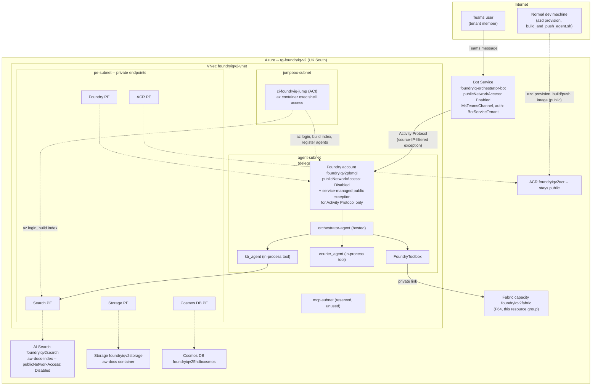

# Foundry IQ v2 — Private Multi-Agent Orchestration

Three hosted agents (Microsoft Agent Framework, Python) running on a fully
VNet-integrated Microsoft Foundry environment: `publicNetworkAccess:
Disabled` on the Foundry account, and every dependent data service behind a
private endpoint.

## Architecture



`kb-agent` and `courier-agent` are also independently registered as their own hosted
agent versions in the same project — reachable directly (from inside the VNet), no
orchestrator required.

## Prerequisites

- An Azure subscription with: Contributor on the target resource group, a Microsoft
  Foundry (Cognitive Services) resource provider with hosted-agent preview features
  available, and Microsoft Fabric capacity licensing (an F-SKU).
- **Azure Developer CLI** (`azd`) — provisions all the infra in one command. Includes
  its own Bicep support; a separate Bicep install isn't needed.
- **Azure CLI** (`az`) — used directly by `azd`'s hooks and by the jumpbox scripts.
- **Python** is not required locally — `scripts/build_search_index.py` only ever runs
  from the jumpbox (Search is private-endpoint-only), which provisions its own Python
  as part of `scripts/jumpbox_setup.sh`. Docker is not required locally either: agent
  images build cloud-side via ACR Tasks (`az acr build`).
- `azd auth login` / `az login` access to the subscription, and `az container exec`
  access to the jumpbox for the one manual step "Step-by-step setup" below calls out.
- On Windows, the `postprovision` hook runs as `sh` — Git Bash (already needed for the
  `scripts/*.sh` files generally) provides that; WSL works too.

## Configuration (`.env`)

```sh
cp .env.example .env
```

`.env.example` (repo root) lists every variable the scripts and agents read. Most of
it is filled in for you automatically: `infra/main.bicep`'s outputs are named to match
these variables exactly, so `azd env get-values > .env` (run automatically by
`infra/hooks/postprovision.sh` after every `azd provision`) produces a working `.env`
with no manual endpoint copy-pasting. The table below is for reference — what each
variable is, and where its value would come from if you ever need to set one by hand:

| Variable | Used by | Where it comes from |
|---|---|---|
| `FOUNDRY_PROJECT_ENDPOINT` | every agent, `build_search_index.py` | `main.bicep` output, via `azd provision` |
| `AZURE_AI_MODEL_DEPLOYMENT_NAME` | every agent, `build_search_index.py` | `main.bicep` output — default `gpt-4.1` |
| `AZURE_SEARCH_ENDPOINT` | `kb-agent`, `orchestrator-agent`, `build_search_index.py` | `main.bicep` output |
| `AZURE_OPENAI_ENDPOINT` | `build_search_index.py` | `main.bicep` output — same Foundry account, OpenAI-compatible endpoint |
| `AZURE_EMBEDDING_MODEL_DEPLOYMENT_NAME` | `build_search_index.py` | `main.bicep` output — default `text-embedding-3-large` |
| `AZURE_SEARCH_INDEX_NAME` / `AZURE_SEARCH_KNOWLEDGE_SOURCE_NAME` / `AZURE_SEARCH_KNOWLEDGE_BASE_NAME` | `build_search_index.py`, `kb-agent`, `orchestrator-agent` | names it creates — defaults are fine unless you want different names |
| `SUBSCRIPTION_ID` / `RESOURCE_GROUP` / `ACCOUNT_NAME` / `PROJECT_NAME` / `ACR_NAME` / `ACR_LOGIN_SERVER` / `SEARCH_NAME` / `STORAGE_NAME` / `JUMPBOX_NAME` / `FABRIC_CAPACITY_NAME` | the shell scripts in `scripts/` | `main.bicep` outputs — override only if you want different names than what `azd provision` created |

Python code (`load_dotenv()`) finds this root `.env` automatically no matter which
subdirectory you run it from. The shell scripts read plain environment variables —
either `export` the file first (`set -a; source .env; set +a`) or rely on each
script's own hardcoded defaults if your resource names match this project's.

`.env` is gitignored — never commit it.

## Resources (`rg-foundryiq-v2`, UK South)

- `foundryiqv2pbmgl` — Foundry account (network-injected, `publicNetworkAccess: Disabled`) + project `iqv2project`
- `foundryiqv2-vnet` — VNet, 4 subnets (agent, pe, mcp, jumpbox), 12 private DNS zones
- `foundryiqv2search` — AI Search (semantic search, index `aw-docs-index`) — `publicNetworkAccess: Disabled`, AAD auth enabled, private endpoint only (flipped by `infra/hooks/postprovision.sh`; the knowledge-base build now runs from the jumpbox — see "Knowledge base" below)
- `foundryiqv2storage` — Storage (`aw-docs` container) — public network access locked `Disabled` by tenant policy; private endpoint added
- `foundryiqv2acr` — ACR (Premium) — stays public (used by `az acr build`), private endpoint added alongside
- `foundryiqv25hdbcosmos` — Cosmos DB for NoSQL (required by Foundry's standard agent setup) — private endpoint only
- `law-foundryiqv2-*` — Log Analytics workspace (Application Insights / agent tracing)
- `ci-foundryiq-jump` — jumpbox (Azure Container Instance in `jumpbox-subnet`) — shell access via `az container exec`, no VM/Bastion
- `foundryiq-orchestrator-bot` — Bot Service (`publicNetworkAccess: Enabled`), MS Teams channel, fronting `orchestrator-agent` — see "Bot Service / Teams" below
- `foundryiqv2fabric` — Fabric capacity (F64), under Bicep (`infra/06-fabric-capacity.bicep`); must be **Active** (not Paused) for the Fabric tool to work — see "Fabric capacity & artifacts" below

## Repo layout

- `azure.yaml` — the `azd` project definition (infra path + the `postprovision` hook)
- `agents/` — `kb-agent/`, `courier-agent/`, `orchestrator-agent/` (see "Agents" below)
- `infra/` — `main.bicep` (the `azd provision` entry point) composing the numbered
  Bicep files as modules, plus `hooks/postprovision.sh` (see "Infra" below)
- `scripts/` — operational scripts (shell + `build_search_index.py`); `jumpbox_setup.sh`
  is the one that runs from inside the jumpbox (see "Step-by-step setup" below)
- `data/aw-docs/` — the 3 source PDFs the knowledge base is built from (see "Knowledge base" below)
- `data/aw-sales/` — the sample AdventureWorks sales dataset the Fabric Data Agent is built from (see "Fabric capacity & artifacts" below)
- `.env.example` — copy to `.env` and fill in (see "Configuration" above)

## Agents (`agents/`)

- `kb-agent/` — grounded in the Foundry IQ Knowledge Base (Adventure Works PDFs)
- `courier-agent/` — FedEx/UPS/DHL assistant via the native `WebSearchTool`
- `orchestrator-agent/` — routes to `kb_agent`/`courier_agent` in-process, and to Fabric
  via the `fabric-iq-toolbox` toolbox (OBO-enabled — see the toolbox's own
  `UserEntraToken` connection, `fabric-dataagent-obo`)

`kb_agent`/`courier_agent` are wired into the orchestrator in-process
(`agent_framework.Agent.as_tool()`), not via Foundry-to-Foundry A2A.

## Infra (`infra/`)

- `main.bicep` — the `azd provision` entry point. Composes `01`, `02`, `03`, `04`, and
  `06` below as modules, with outputs wired automatically into the next module's
  params (subnet IDs, resource names) — one `azd provision` run deploys all five in
  correct dependency order, instead of five separate `az deployment group create`
  calls with IDs copy-pasted by hand between them.
- `main.parameters.json` — deliberately near-empty: every param either has a safe
  Bicep-level default (matching what's already deployed) or no default at all, in
  which case `azd provision` prompts for it interactively (`searchName`, `storageName`,
  `acrName` — the pre-existing resources this project attaches to).
- `hooks/postprovision.sh` — runs automatically after `azd provision`; see
  "Step-by-step setup" below for exactly what it does.
- `01-network.bicep` — VNet + 3 subnets + 12 private DNS zones (`modules/vnet.bicep`, `modules/dns-zones.bicep`)
- `02-data-services.bicep` — private endpoints for the *existing* Search/Storage/ACR (no recreation) + new Cosmos DB + Log Analytics
- `03-foundry-account.bicep` — the network-injected Foundry account + project + model deployments + capability host + RBAC + connections (Cosmos/Storage/Search/ACR)
- `04-jumpbox.bicep` — the ACI jumpbox + its subnet
- `06-fabric-capacity.bicep` — the Fabric capacity (see "Fabric capacity & artifacts" below)

`05-bot-service.bicep` (Bot Service + Teams channel) is deliberately **not** composed
into `main.bicep`: it needs `orchestrator-agent`'s `instance_identity.client_id` as
`msaAppId`, which only exists after the agent is registered — itself only possible
after `azd provision` finishes. It stays a separate, optional follow-on deployment —
see "Bot Service / Teams" below.

## Step-by-step setup (fresh environment)

1. **Clone and configure.**
   ```sh
   git clone https://github.com/pranabpaul-tech/foundry-iq-v2.git
   cd foundry-iq-v2
   cp .env.example .env
   ```

2. **Authenticate and point `azd` at this resource group.**
   ```sh
   azd auth login
   azd env new foundryiq-v2
   azd env set AZURE_RESOURCE_GROUP rg-foundryiq-v2
   ```
   This is a [resource-group-scoped deployment](https://learn.microsoft.com/en-us/azure/developer/azure-developer-cli/resource-group-scoped-deployments)
   (an azd beta feature) — `main.bicep` deploys *into* this existing resource group
   rather than having `azd` create a new one. If you skip `azd env set`, `azd
   provision` prompts you to pick an existing resource group or create one instead.

3. **Provision everything.**
   ```sh
   azd provision
   ```
   Deploys the network, private endpoints for your existing Search/Storage/ACR (+ new
   Cosmos DB), the Foundry account/project, the jumpbox, and the Fabric capacity — all
   in one command, in dependency order. `azd` prompts for `searchName`, `storageName`,
   and `acrName` the first time (your pre-existing resources this project attaches
   to). The Foundry account's capability-host step normally takes 30–35 minutes —
   that's expected, not a hang.

   **Known gotcha — soft-deleted account name collision.** The Foundry account's name is
   deterministic (`uniqueString(resourceGroup().id, 'phase3')` in
   `infra/03-foundry-account.bicep`), so a prior deployment into the same resource group
   that was torn down can leave an orphaned soft-deleted resource (both the Cognitive
   Services account itself and a paired backing Azure ML workspace) that collides with
   the name a fresh `azd provision` tries to reuse -- the error is `A soft-deleted
   resource is causing a deployment conflict` or `Soft-deleted workspace exists`.
   `az cognitiveservices account purge` and `azd down --purge` both looked like the
   right fix but neither reliably clears the paired AML workspace in practice; the
   dependable fix is changing the salt string (`'phase3'` -> anything else) so Bicep
   derives a fresh, non-colliding name and moves on -- no teardown needed. Update this
   README's resource name references (and any hardcoded defaults in `scripts/*.sh`) to
   match afterward.

   `infra/hooks/postprovision.sh` then runs automatically:
   - Writes `.env` from the deployment's outputs (`azd env get-values > .env`) — no
     manual endpoint copy-pasting.
   - Makes Azure AI Search private (`publicNetworkAccess: Disabled` — its private
     endpoint already exists from `azd provision` itself; this is the one remaining
     property flip a fresh Bicep redeclaration would risk getting wrong on an
     already-configured service, so it's a plain `az search service update` instead).
   - Builds and pushes all three agent images via ACR Tasks (no local Docker needed).
   - Resumes the Fabric capacity and ensures a workspace exists
     (`scripts/provision_fabric_workspace.sh`).
   - Prints the one remaining manual step (next).

4. **The one manual step: build the knowledge base and register the agents, from
   inside the jumpbox.** This can't be automated further — it needs a real
   interactive sign-in (a human completing a device-code prompt) and network access
   to the now-private Search/project data planes, both only reachable from inside the
   VNet.
   ```sh
   az container exec -g rg-foundryiq-v2 -n ci-foundryiq-jump --container-name jumpbox \
     --exec-command "az login --use-device-code"
   ```
   Complete the device-code prompt, then:
   ```sh
   az container exec -g rg-foundryiq-v2 -n ci-foundryiq-jump --container-name jumpbox \
     --exec-command "curl -sL https://raw.githubusercontent.com/pranabpaul-tech/foundry-iq-v2/main/scripts/jumpbox_setup.sh -o /tmp/jumpbox_setup.sh"
   az container exec -g rg-foundryiq-v2 -n ci-foundryiq-jump --container-name jumpbox \
     --exec-command "sh /tmp/jumpbox_setup.sh"
   ```
   (Two separate calls, not one piped command — `--exec-command` has no shell behind
   it and splits on whitespace with no quote preservation, so a pipe never survives
   it. See the comment at the top of `scripts/jumpbox_setup.sh`.) This one script
   installs its own Python, builds the knowledge base (see "Knowledge base" below),
   and registers + RBAC-grants all three agents.

5. **Configure the Fabric Data Agent with real data, then create the toolbox
   connection**, from inside the jumpbox (see "Fabric capacity & artifacts" below for
   what this actually does):
   ```sh
   az container exec -g rg-foundryiq-v2 -n ci-foundryiq-jump --container-name jumpbox \
     --exec-command "curl -sL https://raw.githubusercontent.com/pranabpaul-tech/foundry-iq-v2/main/scripts/provision_fabric_sales_agent.py -o /tmp/provision_fabric_sales_agent.py"
   az container exec -g rg-foundryiq-v2 -n ci-foundryiq-jump --container-name jumpbox \
     --exec-command "curl -sL https://raw.githubusercontent.com/pranabpaul-tech/foundry-iq-v2/main/data/aw-sales/adventureworks_sample.zip -o /tmp/adventureworks_sample.zip"
   az container exec -g rg-foundryiq-v2 -n ci-foundryiq-jump --container-name jumpbox \
     --exec-command "env AW_SALES_ZIP=/tmp/adventureworks_sample.zip python3 /tmp/provision_fabric_sales_agent.py"
   ```
   Prints the workspace ID and Data Agent ID at the end -- pass them to
   `create_fabric_toolbox.sh`:
   ```sh
   az container exec -g rg-foundryiq-v2 -n ci-foundryiq-jump --container-name jumpbox \
     --exec-command "curl -sL https://raw.githubusercontent.com/pranabpaul-tech/foundry-iq-v2/main/scripts/create_fabric_toolbox.sh -o /tmp/create_fabric_toolbox.sh"
   az container exec -g rg-foundryiq-v2 -n ci-foundryiq-jump --container-name jumpbox \
     --exec-command "sh /tmp/create_fabric_toolbox.sh <fabric-workspace-id> <fabric-data-agent-id>"
   ```

6. **(Optional) Publish `orchestrator-agent` to Microsoft Teams** — see "Bot Service /
   Teams" below.

7. **Verify** — see "Verification" below.

## Knowledge base: PDFs, chunking, and embedding

Source PDFs live in `data/aw-docs/` (checked into this repo, 3 files). Add, remove, or
replace PDFs there to change what `kb-agent`/`orchestrator-agent` can answer from — no
code changes needed, `scripts/build_search_index.py` picks up every `*.pdf` in that
directory automatically. `scripts/jumpbox_setup.sh` runs it as part of initial setup
(step 4 above); to rebuild later (after editing the PDFs), from inside the jumpbox:
```sh
az container exec -g rg-foundryiq-v2 -n ci-foundryiq-jump --container-name jumpbox \
  --exec-command "curl -sL https://raw.githubusercontent.com/pranabpaul-tech/foundry-iq-v2/main/scripts/jumpbox_setup.sh -o /tmp/jumpbox_setup.sh"
az container exec -g rg-foundryiq-v2 -n ci-foundryiq-jump --container-name jumpbox \
  --exec-command "sh /tmp/jumpbox_setup.sh"
```
(This re-runs agent registration too, which creates new agent versions each time —
harmless, but if you only want to rebuild the index, adapt the script's first half or
run `build_search_index.py` directly with the same env vars.)

This has to run from inside the jumpbox: both Search and the Foundry account's
OpenAI-compatible endpoint (used for embeddings) are private-endpoint-only. What it
does, in order:

1. Extracts text from every PDF in `data/aw-docs/` (`pypdf`).
2. Splits each document's text into chunks — `CHUNK_SIZE_CHARS = 2000` characters with
   `CHUNK_OVERLAP_CHARS = 200` overlap, both set as constants near the top of
   `scripts/build_search_index.py`; edit them there to change chunk size.
3. Embeds each chunk with the `AZURE_EMBEDDING_MODEL_DEPLOYMENT_NAME` deployment
   (`text-embedding-3-large` by default) and uploads into the `AZURE_SEARCH_INDEX_NAME`
   Azure AI Search index (`aw-docs-index` by default).
4. Wraps that index in an `AZURE_SEARCH_KNOWLEDGE_SOURCE_NAME` Knowledge Source and an
   `AZURE_SEARCH_KNOWLEDGE_BASE_NAME` Knowledge Base — the actual thing
   `kb-agent`/`orchestrator-agent` query at runtime.

Safe to re-run after editing the PDFs: each chunk's document ID is a deterministic hash
of `(filename, chunk index)`, so re-running overwrites existing chunks in place instead
of duplicating them.

## Deploying agent updates

For updating a single already-deployed agent later (not the initial setup, which
`scripts/jumpbox_setup.sh` handles for all three at once — see "Step-by-step setup"
above). `azd deploy` doesn't work here — it can't reach the private project endpoint
from outside the VNet, and can't build images from inside the jumpbox (no Docker
there). Two steps instead:

1. **Build + push the image** (from a normal dev machine — ACR stayed public):
   `scripts/build_and_push_agent.sh kb-agent`
2. **Register the agent version** (from inside the jumpbox — data-plane call to the
   private project): `scripts/register_hosted_agent.sh kb-agent '{"AZURE_AI_MODEL_DEPLOYMENT_NAME":"gpt-4.1","AZURE_SEARCH_ENDPOINT":"https://foundryiqv2search.search.windows.net","AZURE_SEARCH_KNOWLEDGE_BASE_NAME":"aw-knowledge-base"}'`
   (Don't set `FOUNDRY_PROJECT_ENDPOINT` or any other `FOUNDRY_*`/`AGENT_*` var yourself
   — reserved, auto-injected by the platform.)
3. Grant the new agent's `AgentIdentity` (`instance_identity.principal_id` in the
   registration response) whatever RBAC it needs — Search roles for `kb-agent`/
   `orchestrator-agent`, `Foundry User` on the project for `orchestrator-agent`
   (needed to read the Fabric toolbox connection). None for `courier-agent`.
4. Test: `scripts/invoke_hosted_agent.sh kb-agent "What is Adventure Works' refund policy?"` (from inside the jumpbox)

## Bot Service / Teams

`orchestrator-agent` is also reachable from Microsoft Teams, via Azure Bot Service —
kept publicly accessible, wired to the private agent through Foundry's own native
publishing mechanism.

**How it works:** Foundry exposes a service-managed, source-IP-filtered public
exception for the agent's Activity Protocol route only (Bot Service and Microsoft 365
source ranges) -- everything else on the project (Responses API, agent management)
stays fully private. The Bot Service resource's `endpoint` points directly at that
exception URL, which Microsoft's Bot Service/Teams infrastructure reaches without ever
touching our VNet.

Channel is Microsoft Teams (auth scheme `BotServiceTenant`: any signed-in tenant
member can use the bot via Teams) — not Direct Line, since a raw/anonymous Direct Line
caller can't satisfy either Bot Service authorization scheme (`BotServiceRbac`/
`BotServiceTenant` both need a real per-caller Entra token, which only Teams carries
through to Foundry).

**Setup, from inside the jumpbox** (same two-call `curl`-then-`sh` pattern as the other
jumpbox scripts — see step 4 in "Step-by-step setup" above for why it's two calls):
```sh
az container exec -g rg-foundryiq-v2 -n ci-foundryiq-jump --container-name jumpbox \
  --exec-command "curl -sL https://raw.githubusercontent.com/pranabpaul-tech/foundry-iq-v2/main/scripts/enable_agent_teams_endpoint.sh -o /tmp/enable_agent_teams_endpoint.sh"
az container exec -g rg-foundryiq-v2 -n ci-foundryiq-jump --container-name jumpbox \
  --exec-command "sh /tmp/enable_agent_teams_endpoint.sh orchestrator-agent BotServiceTenant"
```
Then deploy `infra/05-bot-service.bicep` with `msaAppId` = the agent's
`instance_identity.client_id` (printed by the script above):
```sh
az deployment group create -g rg-foundryiq-v2 -f infra/05-bot-service.bicep \
  --parameters msaAppId=<client-id> tenantId=<tenant-id>
```
The agent version being published needs a non-empty `description` --
`register_hosted_agent.sh`'s optional third argument sets one (repeat the same
environment-variables JSON the version was already registered with, from its
`definition.environment_variables`). A description contains spaces, which
`--exec-command` can't pass through (no shell, no quoting -- see the note at the top
of `scripts/register_hosted_agent.sh`); either use hyphens in place of spaces, or run
the script from a real interactive shell in the container instead of `--exec-command`.

Then, back on the jumpbox, publish to Teams:
```sh
az container exec -g rg-foundryiq-v2 -n ci-foundryiq-jump --container-name jumpbox \
  --exec-command "curl -sL https://raw.githubusercontent.com/pranabpaul-tech/foundry-iq-v2/main/scripts/publish_agent_to_teams.sh -o /tmp/publish_agent_to_teams.sh"
az container exec -g rg-foundryiq-v2 -n ci-foundryiq-jump --container-name jumpbox \
  --exec-command "sh /tmp/publish_agent_to_teams.sh orchestrator-agent"
```
The publish step (Microsoft 365 app publish) is required -- without it, a Teams deep
link built from the raw agent identity App ID resolves to nothing ("couldn't find the
bot"), even with the Bot Service resource and Foundry endpoint correctly wired up.
Beyond `publishScope`, the underlying API also requires `shortDescription`,
`fullDescription`, `developerName`, `developerWebsiteUrl`, `privacyUrl`, and
`termsOfUseUrl` -- `publish_agent_to_teams.sh` fills these with sensible defaults for
this project (all overridable via env vars); if you invoke the API directly instead,
you'll need to supply them yourself, one field's validation error at a time otherwise.

Reference: [Publish an agent as a Bot Service behind a VNet](https://learn.microsoft.com/en-us/azure/foundry/agents/how-to/publish-copilot-virtual-network).

## Fabric capacity & artifacts

The Fabric capacity lives in this resource group as `foundryiqv2fabric` (F64), under
Bicep (`infra/06-fabric-capacity.bicep`, composed into `infra/main.bicep` — deployed
automatically by `azd provision`, no separate step needed).

`Microsoft.Fabric/capacities` is a real ARM resource type — the capacity itself is
fully Bicep-managed. Everything *inside* Fabric — workspaces, and every item type in
them (Lakehouse, Data Agent, Ontology, notebooks, etc.) — has **no ARM resource type at
all**; those are reachable only through the Fabric REST API
(`api.fabric.microsoft.com`), the same way `scripts/create_fabric_toolbox.sh` talks to
Fabric for the OBO connection. `scripts/provision_fabric_workspace.sh` is the
script-based equivalent for those — idempotent find-or-create for a workspace
(assigned to this capacity) plus Lakehouse and Data Agent item shells in it (and an
Ontology shell too, *if* that item type is enabled in your tenant — see the callout
below).

`state` (Active/Paused) is a read-only ARM property — Bicep/PUT can't set it, only a
dedicated resume/suspend action can: `scripts/set_fabric_capacity_state.sh resume|suspend`.
`infra/hooks/postprovision.sh` already calls both this (resume) and
`provision_fabric_workspace.sh` once as part of `azd provision` — the commands below
are for later, e.g. suspending the capacity to stop billing when you're not using it:

```sh
scripts/set_fabric_capacity_state.sh suspend
scripts/set_fabric_capacity_state.sh resume     # before using the Fabric tool again
scripts/provision_fabric_workspace.sh foundryiq-workspace foundryiqv2fabric
```

The Lakehouse and Data Agent items `provision_fabric_workspace.sh` creates start as
empty shells — a Lakehouse with no tables, a Data Agent with no configured data source.
`scripts/provision_fabric_sales_agent.py` (step 5 in "Step-by-step setup" above) makes
the Data Agent real, entirely from the CLI — no Fabric portal step needed:

1. Extracts `data/aw-sales/adventureworks_sample.zip`: 8 pre-built Delta tables (real
   AdventureWorks data — customers, employees, 60,919 order line items, products,
   categories, subcategories, vendors, vendor-product), each already a Parquet file
   plus its own `_delta_log`, not raw CSVs needing conversion.
2. Uploads every file in each table directory, unmodified, to the Lakehouse's
   `Tables/<name>/` path via the OneLake DFS (ADLS Gen2-compatible) API. Fabric
   auto-discovers any valid Delta table folder placed directly under `Tables/` — no
   separate "load table" call needed for a prebuilt table like this (a raw CSV *does*
   need one — see the script's own comments if you're swapping in different source
   data that isn't already Delta-formatted).
3. Builds a Data Agent definition — see [Data Agent item
   definition](https://learn.microsoft.com/en-us/rest/api/fabric/articles/item-management/definitions/data-agent-definition)
   for the format — wiring all 8 tables in as a `lakehouse_tables` data source (nested
   `dbo` schema → table → column `elements`; a flat table-level list with no schema
   wrapper validates and publishes fine but makes the Data Agent fail at query time),
   with AI instructions describing the tables' foreign-key relationships and a few
   join-based few-shot examples, and pushes it via `updateDefinition`.
4. Publishes the Data Agent, promoting the draft to what Fabric MCP (and so
   `create_fabric_toolbox.sh`) actually serves.

Idempotent — re-running overwrites the same-named tables and replaces the whole
definition/publish state. To point it at different source data, replace
`data/aw-sales/adventureworks_sample.zip` with your own zip of Delta table directories
(or adapt the script for raw CSVs) and edit its `TABLE_COLUMNS` dict to match.

**If the Data Agent's answers start failing** (`"The Data Agent run failed before
producing a result"` from the MCP tool, or `"Error: Function failed."` from the
orchestrator) **even though the definition looks correct**, this preview feature has
been observed to get into a stuck state that a config *change* doesn't clear but a
clean removal does: push an `updateDefinition` with no datasource part at all (see the
script for the two-part minimal definition), publish that empty state, then re-run
`provision_fabric_sales_agent.py` to re-add it.

**Ontology:** some Fabric tenants/capacities reject `Ontology` item creation outright
(`Forbidden: FeatureNotAvailable`) — a tenant-level preview-feature gate, not something
fixable from this repo or via the REST API (checking or changing it needs Fabric
tenant-admin rights, a `Tenant.Read.All`-scoped call this project's identities don't
have). If your tenant has it enabled, building entities/relationships over these same
Lakehouse tables and pointing the Data Agent at the ontology (`type: "graph"` in its
datasource config) instead of the tables directly is a reasonable variant to try — it
wasn't possible to validate end-to-end here for exactly that reason.

## Verification

- `nslookup`/`getent hosts` each private-linked FQDN from the jumpbox resolves to a
  `192.168.1.x` address, not a public one.
- Public internet access to the Foundry account's endpoint fails with 403
  (`Public access is disabled. Please configure private endpoint.`).
- Each of the three agents answers correctly when invoked from the jumpbox — confirmed
  end-to-end: kb-agent (KB citation), courier-agent (live web search with citations),
  orchestrator-agent (routed to the Fabric toolbox, returned real joined data from the
  AdventureWorks tables — e.g. correct per-category sales totals and the right
  salesperson by order *count* vs. by total sale value).
- The Teams-published bot responds in a real Teams client (`teamsAppId` from
  `publish_agent_to_teams.sh`'s output; deep link
  `https://teams.microsoft.com/l/app/<teamsAppId>`) — needs a human tenant member
  signed in, since the `BotServiceTenant` auth scheme requires a real Teams-carried
  Entra token; there's no Direct Line/Web Chat fallback for this design, so the Azure
  portal's own "Test in Web Chat" won't work here.
